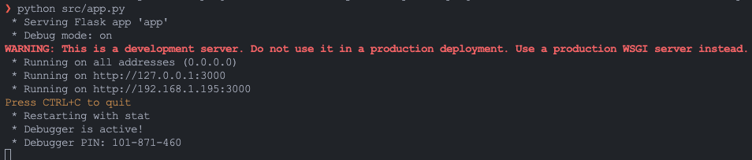
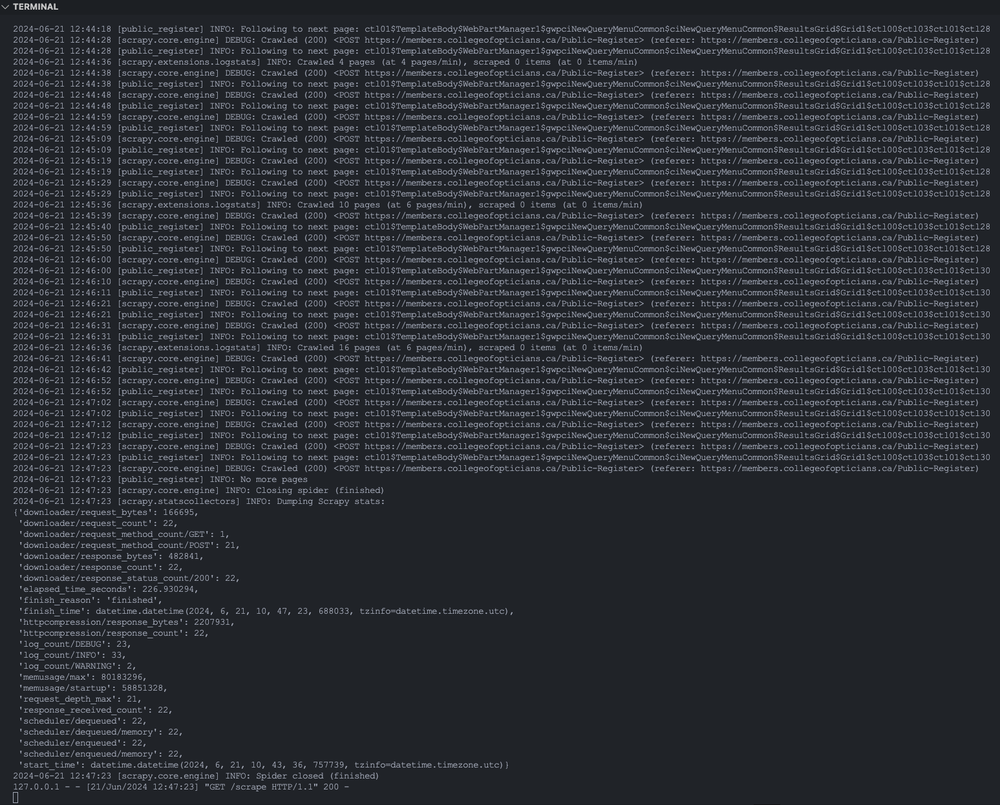
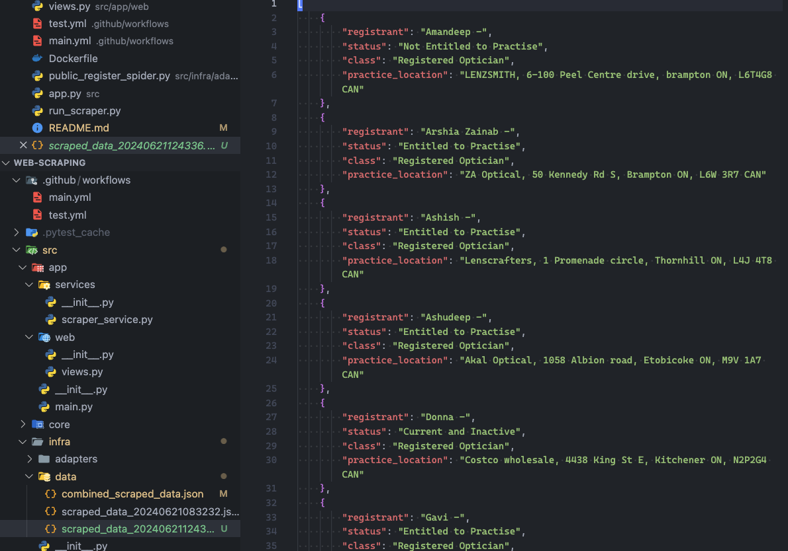

# Web Scraping Project
## Project Overview
This project involves developing a web scraping solution to extract data from the [Public Register](https://members.collegeofopticians.ca/Public-Register) directory. The solution includes a RESTful API to trigger the scraper, saving the extracted data in JSON format, deploying the solution on AWS, implementing CI/CD with GitHub Actions, and setting up a scheduler for regular data updates.

## Features
1. API Development:
  * RESTful API with a `/scrape` endpoint using Flask.
  * Triggers the web scraper and returns scraped data in JSON format.

2. Web Scraping:
* Utilizes Scrapy to handle dynamic content and pagination.
* Saves extracted data into JSON files.

3. Deployment:
* Deployed on AWS EC2 instance.
* Configured with necessary software (Python, Flask, Scrapy).

4. CI/CD Pipeline:
* GitHub Actions workflow for continuous integration and deployment.
* Automates testing, building, and deployment to AWS EC2.

5. Scheduler Setup:
* Uses cron jobs for daily scraping tasks.
* Logs activities for monitoring.

## Project Structure
```markdown
web-scraping/
├── src/
│   ├── app/
│   │   ├── __init__.py
│   │   ├── services/
│   │   │   ├── __init__.py
│   │   │   └── scraper_service.py
│   │   ├── web/
│   │   │   ├── __init__.py
│   │   │   └── views.py
│   │   └── app.py
│   ├── core/
│   │   ├── __init__.py
│   │   └── models/
│   │       ├── __init__.py
│   │       └── scraped_data.py
│   ├── infra/
│   │   ├── __init__.py
│   │   ├── adapters/
│   │   │   ├── __init__.py
│   │   │   └── public_register_spider.py
│   │   └── data/
│   │       └── scraped_data.json
├── run_scraper.py
├── requirements.txt
└── README.md
```

## Setup Instructions
### Prerequisites
* Python 3.9 or higher
* Flask
* Scrapy
* AWS CLI configured
* GitHub repository

### Installation
1. Clone the repository:
```bash
git clone https://github.com/juanfril/web-scraping.git
cd web-scraping
```

2. Install dependencies:

```bash
python3 -m venv venv
source venv/bin/activate
pip install -r requirements.txt
```

### Running the Scraper
1. Run the Flask server:
```bash
export FLASK_APP=src/app/app.py
flask run
```
2. Trigger the scraper via API:
```bash
curl http://127.0.0.1:3000/scrape
```

### Deployment
1. Launch an EC2 instance and configure it with the necessary software (Python, Flask, Scrapy).
2. Deploy the API to the EC2 instance by pushing to the main branch (GitHub Actions will handle the deployment).
3. Set up RDS instance if required for data storage.
### CI/CD with GitHub Actions
* Create a `.github/workflows/main.yml` file with steps for running tests, building the application, and deploying it to the EC2 instance.
### Scheduler Setup
* Configure cron jobs on the EC2 instance to run the scraper daily.
* Ensure logs are maintained for monitoring.

## Usage
* Access the API at `http://ec2-54-93-173-53.eu-central-1.compute.amazonaws.com` to trigger the scraper.
* Check the `src/infra/data/` directory for the `combined_scraped_data.json` file with the extracted data.

## Documentation
* Detailed documentation is available in the docs directory.
* Inline code comments provide explanations for the implementation.

## Demo
* A recorded demo showcasing the working API, web scraper, CI/CD pipeline, and scheduler setup will be provided separately.
### API
* Once the service is available, you can make a request to the path /scrape.

* This will initiate the scraping process and return a 200 status with the message 'Scraping started'.


### Scraper
1. Initiate Scraping:
* When a request is made to `/scrape`, the service initiates the scraping process.
* A `200 OK` response is sent back immediately with the message "Scraping started".

2. Set Up Pagination:
* The scraper sets the page size to 50 results per page to minimize the number of requests and handle data more efficiently.

3. Extract Data:
* For each page, the scraper extracts registrant details (registrant name, status, class, and practice location).

4. Incremental Scraping:
* The scraper processes the data page by page, following the "Next" page button until all pages are scraped.

5. Timestamped File Creation:
* Each time the scraper runs, it generates a unique JSON file with a timestamp in the filename (e.g., scraped_data_YYYYMMDDHHMMSS.json).

* Data Appending:
Data is continuously appended to this unique file during the scraping process to ensure no data is lost and duplication is minimized.
Final Combined File:

* After the scraping process completes, the individual JSON files can be combined into a single combined_scraped_data.json file, ensuring all scraped data is consolidated in one place.




### CI/CD pipeline
The CI/CD pipeline is in progress. Currently, it's failing because the secrets are not being read correctly.
